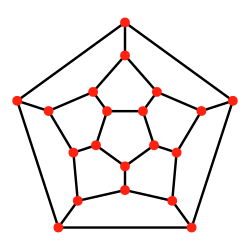

# Recommend ME


## The problem

The internet is loaded with so many documents, from which not all have proven to be either good enough or understandable, it then becomes confusing for students to pick one to start with - they end up surrendering.

Let's say one student - call him Mike - didn't make it to the Graphs lecture one day and he decides to have a look at the notes by himself. However, the lecture PDF presentation doesn't seem to help very much, since it doesn't contain the full explanations of concepts - only brief notes, some formulae and schemas Mike doesn't really understand.

He wants to have a better image of what _planar graphs_ are and how they work. On a fast Google search, Mike gets ~5.140.000 results in less than half a second. 5 _million_ results. Where to begin? First result is from _Wikipedia_. Click.


Mike has no idea what this means. Mike needs more beginner-like content. Mike is very confused. Mike then sees this image - it's a _Schlegel diagram of a regular dodecahedron, forming a planar graph from a convex polyhedron_:



Mike doesn't like it very much and eventually gives up.

## The idea

_Recommend ME_ was thought to be a tool designed for the Computer Science students in order for them to deepen their knowledge in the more "abstract" fields by offering them good, readable, external resources for documentation.

## How it works

_Recommend ME_ uses NLP in order to analyze either lecture notes or descriptions of them so as to find references in the top profile books, offering students precise coordinates of where to search for the information they need.

We start by extracting key phrases from the lecture notes using _pytextrank_, assigning a relevance score to each of them at the same time. For instance, for the Planar Graphs lecture, a dictionary of the most relevant key phrases together with their scores may look like this:

```
{
    "a connected bipartite planar graph": 0.05415530592941251,
    "a connected planar graph": 0.05434663483288733,
    "a graph g": 0.053073150541127476,
    "a maximal planar graph": 0.0527544211462139,
    "bipartite planar graph": 0.07970435570092213,
    "circuit": 0.0299791670686525,
    "faces": 0.053330544440336004,
    "m edges": 0.053962214210097434,
    "most 2pn vertices": 0.061278561234393715,
    "planar graphs": 0.07299307717342685,
    "planar graphs drawing": 0.05910894331652115,
    "point": 0.023979167068652496,
    "points": 0.05205383401726972,
}
```
Note: we removed most of the noisy data in this example, since it doesn't really affect the outcome.

We then expand this dictionary by adding substrings of the key phrases in order to increase the probability of finding the desired references. The assigned scores for these keywords will be proportional with the _relevance_ of the key phrase they come from, starting with the _mean_ of the initial scores.

Note #2: Our heuristic is based on the fact that finding an exact match for the phrase _planar graphs_ is a lot more "valuable" than just finding matches for the word "graphs" - which is extremely likely to have a more uniform distribution. However, finding the word _planar_ alone, should still be more "valuable" than finding the word "point", for instance - thus, the balance: **even _a sequence_ of the highest rated key phrase is more relevant than the lowest rated one, but still not as relevant as the mean value.**

```
{
    "a connected bipartite planar graph": 0.05415530592941251,
    "a connected planar graph": 0.05434663483288733,
    "a graph g": 0.053073150541127476,
    "a maximal planar graph": 0.0527544211462139,
    "bipartite": 0.04997916706865252,
    "bipartite planar graph": 0.07970435570092213,
    "circuit": 0.0299791670686525,
    "connected": 0.025979167068652498,
    "drawing": 0.0319791670686525,
    "edges": 0.05511474641097551,
    "faces": 0.053330544440336004,
    "graph": 0.06768150124029548,
    "graphs": 0.04797916706865252,
    "m edges": 0.053962214210097434,
    "maximal": 0.013979167068652489,
    "most 2pn vertices": 0.061278561234393715,
    "planar": 0.04997916706865252,
    "planar graphs": 0.07299307717342685,
    "planar graphs drawing": 0.05910894331652115,
    "point": 0.023979167068652496,
    "points": 0.05205383401726972,
    "vertices": 0.06612472131247861
}
```

Below you can find the distribution of the most relevant keywords from the _Planar Graphs_ lecture notes across the book _"Graph Theory" by Reinhard Diestel_, as calculated after extracting the text from the Electronic Edition PDF.

<br>
<iframe src="https://cdn2.datamatic.io/runtime/echarts/3.7.2_293/embedded/index.html#id=104730706846367182626/1aKDHPXDjkp-lyMJYMaiAe-566oAR4q39" frameborder="0" width="100%" height="536.9850435256958" allowtransparency="true"></iframe>

What is noticeable is that, except for the word _planar_, all the other words seem to have pretty uniform distributions and this is where the heuristic we have proposed has a significant impact. Therefore, our goal becomes to calculate and point out the _"best"_ clusters of keywords found in the book - this is where the content related to the lecture should be found.

## Implementation details

After creating mappings for different courses and books as a basis, the idea is to create so-called _dynamic buckets_ of potential content that matches the PDF subject to a certain chapter of a profile book.
What we are looking for in a bucket is, in fact, a "condensed" crowd of meaningful words, which ideally has a weighted sum high enough to be considered an option for a recommendation. The more keywords and the more relevant they are, the better the bucket.

Below is a representation of the best 7 such buckets, with respect to their accumulated score. There is, of course, the first bucket (between pages 73-102) which stands out due to the initially assigned weights and this is the case for most of the scenarios, since usually there is one dedicated chapter for each topic in a book.

<br>
<iframe src="https://cdn2.datamatic.io/runtime/echarts/3.7.2_293/embedded/index.html#id=104730706846367182626/1Y8i1eLO8YR0WCI4PxEDAeeNYz7CIReuv" frameborder="0" width="100%" height="524.9957275390625" allowtransparency="true"></iframe>
<br>

<iframe src="https://cdn2.datamatic.io/runtime/echarts/3.7.2_293/embedded/index.html#id=104730706846367182626/1y_1HG9rEwzoaaF16lNzw9XcdruN-nNxq" frameborder="0" width="100%" height="503.98504638671875" allowtransparency="true"></iframe>

<iframe src="https://cdn2.datamatic.io/runtime/echarts/3.7.2_293/embedded/index.html#id=104730706846367182626/1AXatR1dlMHqRv6AQBRGtakbnS9T5GdXb" frameborder="0" width="100%" height="480.99359130859375" allowtransparency="true"></iframe>

## Next steps

For improved accuracy, we have also added an option for the users to choose the keywords they believe describe the best the lecture. This obviously increases the probability of identifying the best #1 cluster as the target section, since the noisy data is, in theory, zero. Of course, this could be extended to another heuristic: _the more numerous and particular the keywords are and the more accurate are their weights, the better the result_.

We also wanted to cover the problem of more "advanced issues" students may be interested in and for this matter we have also provided resources for scholarly articles where further, deeper and more punctual information can be found. arXiv® is a free such distribution service, maintained and operated by _Cornell University_ and this is our source for the research papers. We use the concepts the user is interested in and sort the results depending on how "readable" (advanced) the content is. To implement this, we have used the Flesch-Kincaid readability tests, designed to indicate how difficult a passage in English is to understand. In the FK reading-ease test, higher scores indicate material that is easier to read; lower numbers mark passages that are more difficult to read. The formula for the Flesch reading-ease score (FRES) test is:

<br>

